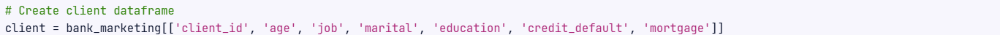
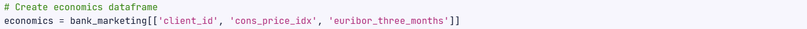

# Bank Marketing Campaign

This project focuses on transforming raw bank marketing data into structured, clean datasets that can be seamlessly integrated into a PostgreSQL database. By organizing data into separate CSV files for client information, campaign interactions, and economic indicators, the project ensures future scalability for marketing analysis.

## Objectives
1. **Subset** the original dataset into three separate DataFrames: **client**, **campaign**, and **economics**.
2. **Clean** and **format** the data according to specified data types.
3. **Save** the cleaned DataFrames as CSV files.

## Dataset Description
- The original dataset, **bank_marketing.csv**, was processed and split into the following files:
- **client.csv** - Contains **demographic** and **financial information** about clients.
- **campaign.csv** - Records **details of marketing campaigns** and client interactions.
- **economics.csv** - Stores **economic indicators** related to the clients.

## Installation
Clone this repository and install the necessary libraries if required:
```bash
git clone https://github.com/JReaves10/BankMarketingCampaign
cd BankMarketingCampaign
```
- Ensure you have Python and required libraries (pandas, numpy) installed.
- Place the original **bank_marketing.csv** file in the working directory.
- Run the script to generate the three CSV files.

## Code Explanation
### 1. Reading the Dataset
We begin by importing necessary libraries (*pandas* and *numpy*) and reading the dataset using pd.read_csv()


### 2. Creating DataFrames
#### Client DataFrame
Extract columns related to client information:



#### Campaign DataFrame
Select columns related to marketing campaign details:


#### Economics DataFrame
Subset columns with economic indicators:



### 3. Cleaning and Formatting
#### Client DataFrame Cleaning:
- Replace . with _ in the job column.
- Replace unknown in the education column with NaN.
- Convert credit_default and mortgage columns to boolean values.


#### Campaign DataFrame Cleaning
- Map campaign_outcome and previous_outcome to binary values.
- Format the day and month columns, and create a last_contact_date column.
- Convert date column to datetime format and remove unnecessary columns.


#### 4. Saving DataFrames as CSV Files
Each DataFrame is saved to a .csv() file without including the index.


## Results
- Three cleaned and formatted .csv() files were generated: **client.csv**, **campaign.csv**, and **economics.csv**.
- The data is now structured and ready for storage in a SQL database, enabling easier analysis and integration of future campaigns.

## Conclusion
This project successfully demonstrates the process of data cleaning, reformatting, and storage for future marketing campaign analysis.

### Technology Used
- Language: **Python**
- Libraries: **Pandas**, **NumPy**
